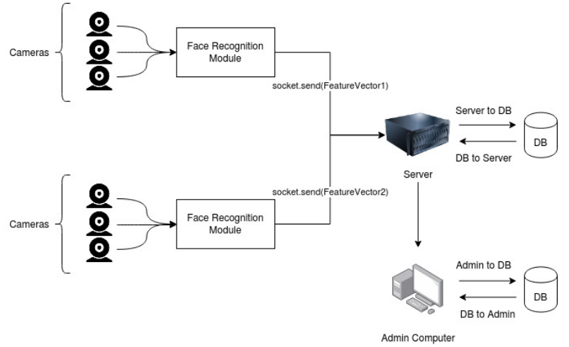

# Attendance-System-Using-Image-Recognition
Attendance System Using Image Recognition for Software Engineering Project

Team 19

- Keshavan Seshadri [20171051]
- Neerja Gangwar [2019201020]
- Shreya Vanga [2019201087]
- Ayush Deva [201501098]
- Nikhil Jakhar [20171186]
- Pranay Gupta [20161088]

## How does it work? 

## Pipeline

#### Digital Image Acquisition:

- In the larger scheme of things we would require cameras to be installed on the entrances, but for the sake of the project we are using the feed incoming through the webcams
- These cameras record the feed and pass it on to the face recognition module.

#### Face Detection

- The face detection algorithm calculates the feature vector for every detected face, and passes it on to the central server.
- This task is done in a distributed fashion, because the multiple feeds are being captured simultaneously.
- We use a pretrained facenet which is a state of the art and the most robust face detection algorithm, to get the final feature vector of the face.

#### Enrollment and Marking

- The face vector obtained in the last step is sent over to the main server, using socket programming, which contains the dictionary of the enrolled students, against the facial feature vectors.
- The face vector obtained on the central server is now compared with all the faces already present in the database, on finding a match, the candidate is marked present.
- Matching is done using the L2 distance between face vectors, and some threshold value. 
- In case the face vector can not be matched with any of the vectors present in the database, the person now has to be enrolled for detection in future. The server replies accordingly with a present or a prompt for details required for enrollment.

## FAQs
##### 1. Is the Project Scalable and Maintainable?
The main goal of the project is to make it scalable so that we can use the same code for a higher use case such as security surveillance.

##### 2. Is there documentation available?
The code is documented while writing and we have followed good naming practices for 
functions to make it easily comprehensible.

##### 3. What language is the code written?
The code is written in python and it uses deep learning frameworks like facenet for face recognition.

##### 4. What are the concepts involved?
Apart from all software engineering related concepts like Data Abstraction, OOP, ACID, 
and good design, the concepts of deep learning and distributed systems will be used.
